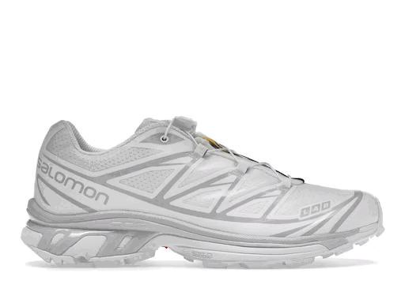

  

  
  
  
  
  

  <ul>
    
<h1 style="display: inline-block;">Hey 👋, I'm Christian Cheng (kChris)</h1>

    
Software Developer, Trader & Sneaker Enthusiast from 🇸🇬 Singapore, currently living in 🇦🇺 Australia.

  </ul>

  <h3>✏️ Things I Code With:</h3>
  

    
    
    
    
    
    
  

  <h3>💻 My Current Projects:</h3>
  <table>
    <thead align="center">
      <tr border: none;>
        <td><b>Projects</b></td>
        <td><b>Status</b></td>
      </tr>
    </thead>
    <tbody>
      <tr>
        <td>Coming Soon...</td>
        <td align="center">⏳</td>
      </tr>
    </tbody>
  </table>

  <h3>📝 My Blog:</h3>
  <ul>
    <li>Coming Soon...</li>
  </ul>

  <h3>👟 My Latest Pickup:</h3>
  <h4>Salomon XT-6 White Lunar Rock (White/White/Lunar Rock) (26/06/23)</h4>
  
Design: ⭐⭐⭐⭐⭐ | Comfort: ⭐⭐⭐⭐ | Sizing: Size Up

  

  <h3 align="center">My Discord Status:</h3>
  

    
  

